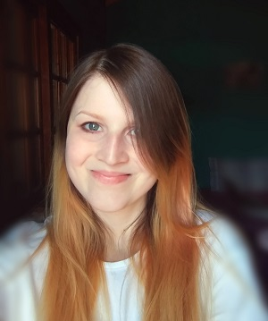

# Carolina Denisse Paleari #  
  
Tengo **22 años**.   
Ya no se me ocurre qué más decir. Odio las presentaciones. Odio este TP.  
  
Estudio *programación informática en la UNSAM*. Me encanta todo lo esté relacionado con matemática, lógica y computación. Mis segundos amores son el lenguaje musical y canto.  
Tengo el sueño más deforme del universo. Puedo variar de despertarme a las 10 de la mañana a despertarme a las 8 de la noche en menos de 2 semanas.  
  
Puedo resumir mis **intereses** mirando mi inicio de cualquier red social:  
- Gatos.  
- Focas.  
- Comida.  
- Café.  
- Maquillaje.  
  
Lo único interesante en vida es entrar a YouTube, ir de arriba abajo revisando recomendaciones e irme porque no hay nada bueno. Posteriormente, meterme a Twitch buscando consuelo, ver que nadie de los que sigo está online, y buscar consuelo en Instagram. Este ciclo se repite mínimo 10 veces por día.  
Si ninguna de esas cosas sirve, puedo probar con algún juego en el que mi cerebro se canse después de 1 hora. Mis favoritos son:  
- Silent Hill 2 y 3.  
- Geometry Dash.  
- The Binding of Isaac.  
- Sims 4.  
- Tetris.  
  
Cuando era más chiquita podía recurrir a dibujar, hacer alguna manualidad, escribir historias. Pero con el tiempo fui quedándome sin imaginación. Ahora mi objetivo en la vida es aburrirme, hacer fiaca y graduarme. Y no, no sé qué carajo voy a hacer después de eso. Es problema para la Caro del futuro. 
  
Como no me gustan las presentaciones, tampoco me gustan las fotos. Pero acá va una por el bien del TP0.  
